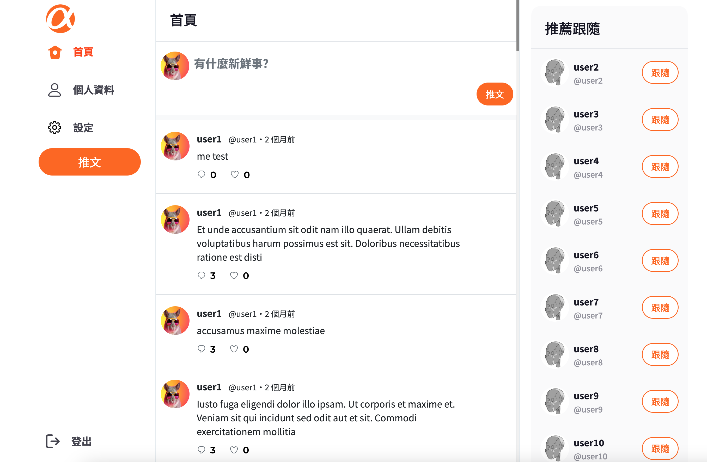

# Simple Twitter

A social media website built with node.js and express. Users can register, log in, log out, browse, and post tweets. They can also edit personal profiles, view others' profiles, see others' tweets, and replies. Additionally, the website has an admin feature allowing administrators to view and delete specific tweets and view information of all users.



# Features

- User Features
  - Register/Login/Logout functionality.
  - Error prompts for repeated registration, login errors, and accessing services without logging in.
  - Users can view all tweets on the homepage.
  - Users can post new tweets.
  - Users can view specific posts' content and reply threads.
  - Users can reply to other users' tweets.
  - Clicking on the user's avatar allows for viewing that user's profile and tweet content.
  - Users can follow/unfollow other users.
  - Users can edit their name, introduction, profile picture, and personal background.
  - Users can like or unlike other users' tweets.
  - Users can view and follow/unfollow the top 10 recommended users in the right sidebar.
  
- Admin Features
  - Administrators can view the list of tweets & delete specific tweets.
  - Administrators can view the list of all users on the site.

# Environment Setup

For detailed information, please refer to the package.json file.
- Visual Studio Code: 1.81.1
- Node.js: 14.16.0
- Express.js: 4.16.4
- Express-handlebars: 5.3.3
- bcryptjs: 2.4.3
- express-session: 1.15.6
- method-override: 3.0.0
- passport: 0.4.0
- passport-local: 1.0.0
- sequelize: 6.18.0
- sequelize-cli: 6.2.0

# Install & Execution

1. Install Node.js.
2. Open the terminal and clone the project to your computer:
```
git clone https://github.com/scheng0718/simple-twitter.git
```
3. Navigate to the project folder:
```
cd simple-twitter
```
4. Set up environment variables. Refer to the .env.example file in the root directory, replace the SKIP content, and add it to the .env file.

5. Create databases.
Open MySQL workbench, connect to the local database, and create the following databases:

```
drop database if exists ac_twitter_workspace;
create database ac_twitter_workspace;
use ac_twitter_workspace;

drop database if exists ac_twitter_workspace_test;
create database ac_twitter_workspace_test;
use ac_twitter_workspace_test;
```
6. Install npm packages:
```
npm install
```
7. Install nodemon:
```
npm install -g nodemon
```
8. Database migration setup:
```
npx sequelize db:migrate 
```
9. Add default seed data:
```
npx sequelize db:seed:all 
```
10. Start the project:
```
npm run start
```
11. Open your web browser and visit: 
```
http://localhost:3000
```
12. The email and password for testing purpose.
    ||Name|Email|Password|
    |:--|:--|:--|:--|
    |1|root|root@example.com|12345678|
    |2|user1|user1@example.com|12345678|
    |3|user2|user2@example.com|12345678|

13. To exit the application and stop the server: 
```
ctrl + c
```

## Developers
Annie/Evan/Gibbs